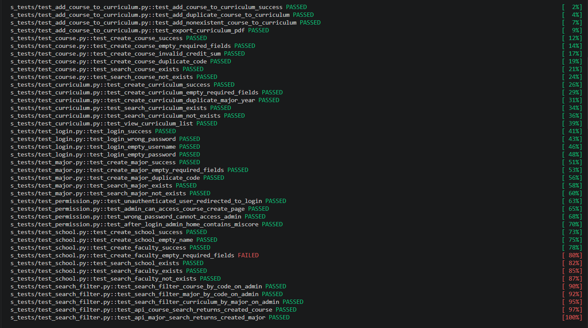

# THỰC HÀNH LAB 9: KIỂM THỬ GIAO DIỆN TỰ ĐỘNG VỚI SELENIUM

**Thông tin sinh viên:**
* **Họ và tên:** Đồng Đại Đạt  
* **Mã sinh viên:** 23010877  

---

## 1. GIỚI THIỆU VỀ SELENIUM

**Selenium** là bộ công cụ hỗ trợ kiểm thử tự động cho các ứng dụng web. Selenium cho phép lập trình viên hoặc kiểm thử viên điều khiển trình duyệt giống như một người dùng thực: mở trang web, nhập dữ liệu vào biểu mẫu, nhấn nút, lựa chọn dữ liệu, kiểm tra thông báo và xác minh kết quả hiển thị trên giao diện.

Trong bài thực hành này, Selenium WebDriver được sử dụng cùng với ngôn ngữ Python và thư viện Pytest để xây dựng các kịch bản kiểm thử tự động cho hệ thống quản lý chương trình đào tạo UniMIS.

Các khả năng chính của Selenium bao gồm:

* **Tự động điều khiển trình duyệt:** Mô phỏng thao tác của người dùng trên Chrome như truy cập URL, nhập liệu, nhấn nút, chọn danh sách và tải tệp.
* **Xác định phần tử giao diện:** Hỗ trợ nhiều loại locator như `id`, `name`, `class_name`, `xpath`, `css selector` để xác định chính xác các thành phần trên trang web.
* **Kiểm tra kết quả hiển thị:** Cho phép xác minh tiêu đề trang, thông báo lỗi, dữ liệu trong bảng, trạng thái chuyển hướng và nội dung HTML.
* **Chờ phần tử tải xong:** Sử dụng `WebDriverWait` để giảm lỗi do trang tải chậm hoặc phần tử chưa sẵn sàng để thao tác.
* **Kết hợp với Pytest:** Giúp tổ chức test case theo từng chức năng, chạy hàng loạt test và thống kê số lượng test thành công hoặc thất bại.
* **Hỗ trợ kiểm thử hồi quy:** Sau mỗi lần chỉnh sửa hệ thống, toàn bộ kịch bản có thể được chạy lại nhanh chóng để phát hiện lỗi phát sinh.

---

## 2. CÔNG CỤ VÀ MÔI TRƯỜNG SỬ DỤNG

* **Công cụ kiểm thử chính:** Selenium WebDriver.
* **Ngôn ngữ lập trình:** Python.
* **Framework chạy kiểm thử:** Pytest.
* **Trình duyệt kiểm thử:** Google Chrome.
* **Hệ thống được kiểm thử:** Website quản lý chương trình đào tạo UniMIS.
* **Công nghệ hệ thống:** Django, PostgreSQL và Docker Compose.
* **Quản lý mã nguồn:** GitHub.
* **Hệ điều hành thực hiện:** Windows.

Các thư viện Python được cài đặt bằng lệnh:

```bash
pip install selenium pytest pytest-html
```

Khởi động hệ thống UniMIS bằng Docker:

```bash
docker compose up -d
```

Chạy toàn bộ test Selenium:

```bash
pytest s_tests -v
```

Xuất báo cáo kiểm thử HTML:

```bash
pytest s_tests -v --html=selenium_report.html --self-contained-html
```

---

## 3. NỘI DUNG THỰC HIỆN

Trong phạm vi bài thực hành, bộ kiểm thử Selenium được xây dựng cho các chức năng chính của hệ thống UniMIS. Các kịch bản kiểm thử tập trung vào thao tác đăng nhập, quản lý dữ liệu đào tạo, tìm kiếm, phân quyền và xuất chương trình đào tạo.

| STT | Nhóm chức năng | Test case tiêu biểu | Mục tiêu kiểm thử |
| :---: | :--- | :--- | :--- |
| 1 | **Đăng nhập** | Đăng nhập thành công | Xác minh người dùng quản trị có thể đăng nhập bằng tài khoản hợp lệ. |
| 2 | **Đăng nhập** | Đăng nhập sai mật khẩu | Xác minh hệ thống từ chối thông tin đăng nhập không đúng. |
| 3 | **Đăng nhập** | Bỏ trống tên đăng nhập hoặc mật khẩu | Kiểm tra thông báo yêu cầu nhập dữ liệu bắt buộc. |
| 4 | **Quản lý môn học** | Tạo môn học thành công | Xác minh có thể thêm mới môn học với dữ liệu hợp lệ. |
| 5 | **Quản lý môn học** | Tạo môn học thiếu trường bắt buộc | Kiểm tra validation khi người dùng bỏ trống dữ liệu cần thiết. |
| 6 | **Quản lý môn học** | Tìm kiếm môn học | Xác minh chức năng tìm kiếm theo mã hoặc tên môn học. |
| 7 | **Quản lý ngành** | Tạo và tìm kiếm ngành | Kiểm tra chức năng thêm mới, kiểm tra dữ liệu trùng và tìm kiếm ngành. |
| 8 | **Quản lý chương trình đào tạo** | Tạo chương trình đào tạo | Xác minh có thể tạo chương trình đào tạo với ngành và năm áp dụng hợp lệ. |
| 9 | **Quản lý chương trình đào tạo** | Kiểm tra dữ liệu trùng | Không cho phép tạo hai chương trình cùng ngành và cùng năm áp dụng. |
| 10 | **Liên kết môn học** | Thêm môn học vào chương trình đào tạo | Xác minh môn học được thêm thành công vào chương trình đã chọn. |
| 11 | **Xuất dữ liệu** | Xuất PDF chương trình đào tạo | Kiểm tra hệ thống tạo tệp PDF chương trình đào tạo. |
| 12 | **Phân quyền** | Truy cập khi chưa đăng nhập | Kiểm tra người dùng chưa xác thực bị chuyển về trang đăng nhập. |

Trong đó, ba test case tối thiểu đáp ứng yêu cầu bài tập gồm:

| Mã TC | Tên test case | Các bước thực hiện | Kết quả mong đợi |
| :---: | :--- | :--- | :--- |
| TC01 | Đăng nhập thành công | Mở trang đăng nhập, nhập đúng tên đăng nhập và mật khẩu, nhấn nút đăng nhập. | Hệ thống chuyển đến trang quản trị Django. |
| TC02 | Tạo môn học thành công | Đăng nhập, vào chức năng quản lý môn học, nhập dữ liệu hợp lệ và lưu. | Môn học mới được tạo và xuất hiện trong danh sách. |
| TC03 | Tìm kiếm môn học tồn tại | Đăng nhập, nhập mã hoặc tên môn học vào ô tìm kiếm. | Hệ thống hiển thị đúng môn học cần tìm. |

---

## 4. KẾT QUẢ THỰC HIỆN KỊCH BẢN

Dưới đây là các hình ảnh ghi nhận quá trình chạy bộ kiểm thử Selenium và kết quả thực tế trên hệ thống UniMIS.

### 4.1. Cấu trúc thư mục kiểm thử Selenium
*Các test case được tổ chức theo từng nhóm chức năng như đăng nhập, môn học, ngành, trường, chương trình đào tạo, phân quyền và tìm kiếm.*

```text
selenium_tests/
│
├── s_tests/
│   ├── test_login.py
│   ├── test_course.py
│   ├── test_major.py
│   ├── test_school.py
│   ├── test_curriculum.py
│   ├── test_add_course_to_curriculum.py
│   ├── test_permission.py
│   └── test_search_filter.py
│
├── conftest.py
├── requirements.txt
└── README.md
```

### 4.2. Kiểm thử đăng nhập thành công
*Xác minh người dùng có thể đăng nhập vào trang quản trị khi cung cấp đúng tên đăng nhập và mật khẩu.*

### 4.3. Kiểm thử tạo môn học
*Thực hiện thao tác thêm mới môn học với các thông tin hợp lệ như mã môn học, tên môn học và số tín chỉ.*

### 4.4. Kiểm thử tìm kiếm môn học
*Nhập mã hoặc tên môn học vào ô tìm kiếm và kiểm tra dữ liệu trả về có đúng với dữ liệu đã tạo.*

### 4.5. Kiểm thử tạo chương trình đào tạo
*Xác minh hệ thống có thể tạo chương trình đào tạo mới với ngành và năm áp dụng hợp lệ.*

### 4.6. Kiểm thử thêm môn học vào chương trình đào tạo
*Kiểm tra thao tác liên kết môn học với chương trình đào tạo đã tồn tại.*

### 4.7. Kiểm thử phân quyền
*Xác minh người dùng chưa đăng nhập không thể truy cập trực tiếp vào các trang quản trị của hệ thống.*

### 4.8. Kết quả chạy toàn bộ bộ kiểm thử Selenium
*Kết quả Pytest cho thấy phần lớn test case đã chạy thành công. Bộ kiểm thử bao gồm các chức năng đăng nhập, tạo dữ liệu, tìm kiếm, phân quyền, thêm môn học vào chương trình đào tạo và xuất PDF.*



---

## 5. TỔNG HỢP KẾT QUẢ KIỂM THỬ

Dựa trên kết quả chạy Pytest thực tế, bộ kiểm thử gồm **41 test case**, trong đó có **40 test case PASS** và **01 test case FAILED**.

| Chỉ số | Kết quả |
| :--- | :---: |
| Tổng số test case | **41** |
| Test case thành công | **40** |
| Test case thất bại | **01** |
| Tỷ lệ thành công | **97,56%** |

Test case còn thất bại là:

| Test case | Trạng thái | Nhận xét |
| :--- | :---: | :--- |
| `test_create_faculty_empty_required_fields` | FAILED | Test kiểm tra việc bỏ trống trường bắt buộc khi tạo khoa chưa đạt. Cần kiểm tra lại locator, thông báo validation hiển thị trên giao diện hoặc điều kiện `assert` trong mã kiểm thử. |

Các test case còn lại đã chạy thành công, bao gồm:

* Kiểm thử đăng nhập thành công, sai mật khẩu và bỏ trống thông tin đăng nhập.
* Kiểm thử tạo mới, kiểm tra dữ liệu trùng và tìm kiếm môn học.
* Kiểm thử tạo mới, kiểm tra dữ liệu trùng và tìm kiếm ngành.
* Kiểm thử tạo mới, kiểm tra dữ liệu trùng và tìm kiếm chương trình đào tạo.
* Kiểm thử thêm môn học vào chương trình đào tạo.
* Kiểm thử xuất PDF chương trình đào tạo.
* Kiểm thử chuyển hướng khi chưa đăng nhập và phân quyền truy cập trang quản trị.

---

## 6. ĐÁNH GIÁ VÀ NHẬN XÉT

Thông qua quá trình thực hành, em đã áp dụng Selenium để tự động hóa nhiều thao tác kiểm thử trên giao diện web thay vì thực hiện thủ công. Selenium giúp kiểm tra nhanh các luồng chức năng lặp lại như đăng nhập, thêm dữ liệu, tìm kiếm và kiểm tra quyền truy cập.

Bộ kiểm thử được xây dựng theo từng nhóm chức năng riêng biệt nên dễ quản lý, dễ chạy lại và thuận tiện khi mở rộng thêm test case. Việc sử dụng `WebDriverWait` giúp giảm các lỗi phát sinh do trang web tải chậm hoặc phần tử giao diện chưa sẵn sàng để thao tác.

Kết quả chạy đạt 40/41 test thành công, tương đương 97,56%. Điều này cho thấy các chức năng chính đã được kiểm thử hoạt động tương đối ổn định. Một test case còn lỗi cần được xem xét lại để xác định nguyên nhân là do giao diện chưa hiển thị validation đúng như mong đợi hay do điều kiện kiểm tra trong mã Selenium chưa phù hợp.

---

## 7. KẾT LUẬN

Bài thực hành đã đáp ứng yêu cầu xây dựng tối thiểu 03 test case kiểm thử tự động bằng Selenium. Thực tế, bộ kiểm thử đã được triển khai với 41 test case cho nhiều chức năng của hệ thống UniMIS.

Qua bài thực hành, em đã hiểu được cách thiết lập môi trường Selenium, tổ chức test case bằng Pytest, xác định phần tử trên giao diện bằng locator, sử dụng cơ chế chờ tường minh và kiểm tra kết quả tự động. Selenium là công cụ phù hợp để hỗ trợ kiểm thử hồi quy, giúp tiết kiệm thời gian và nâng cao độ tin cậy khi phát triển ứng dụng web.
